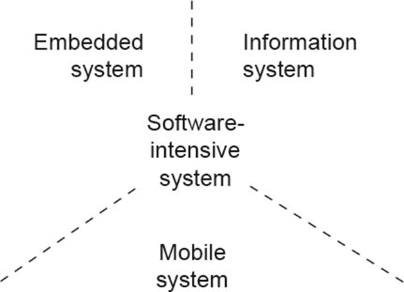

# 2.2软件系统和软件架构

软件架构总是在相关系统中体现出来，无论它是经过明确设计的还是自然演进的。因此，在我们更详细地研究此类系统的架构之前，必须首先清楚地了解什么是软件密集型系统。在接下来的部分中，我们将首先定义“软件密集型系统”这个术语，并讨论不同类型的软件密集型系统。在此基础上，我们便能够确定与所涉及系统的软件架构的关系。

## 2.2.1 What 是软件密集型系统?

首先这里有一个基本问题：什么是系统？我们可以在 IEEE 标准 610.12 - 1990，即 IEEE 软件工程术语标准词汇表中找到这个问题的答案。那里对系统的定义如下：

> \*\*系统。\*\*一组为完成特定功能或一组功能而组织起来的组件的集合。

这个看起来相当直观的定义恰当地描述了一个系统的基本属性。系统由诸如硬件、软件或机械构件等构建模块和组件组成。这个系统的定义还包括系统可以分解为构建模块的概念。依照上述定义，一个系统还必须服务于特定目的。这反映了工程学的基本理解，即创造对人们生活质量有积极影响的事物（参见 NSPE 工程师道德准则\[NSPE]）。

“软件密集型系统”的第二个关键要素是“软件”这个术语。在这种情况下，我们在 IEEE 软件工程术语标准词汇表中也能找到一个定义。

> \*\*软件。\*\*软件包括计算机程序、流程，可能还包括与计算机系统运行相关的文档和数据。

软件因此不仅仅是程序文件的集合。软件还包括其他程序，如配置脚本、相关文档（例如架构描述）和数据（例如用必要的元数据和主数据对数据库进行的初始填充）。

为了在本章的背景下制定软件密集型系统的定义，我们需要结合上述两个定义，并包括软件在系统中的密集作用。基于这种方法, 软件密集型系统定义如下:

> **软件密集型系统**是一组以特定方式组织起来的构建模块的集合，它们共同实现系统的目的。这种系统的构建模块完全或大部分由软件组成，为实现系统目的执行关键任务。系统的软件元素由程序、流程、数据和相关文档的集合组成。

**2.2.2 软件密集型系统的类型**

存在不同的对软件进行分类的方法。每种方法都侧重于特定的属性，因此并非普遍适用。例如，在 IEEE 软件工程术语标准词汇表对“软件”一词的定义中，就区分了应用软件、支持软件和系统软件：


软件。另见:应用软件;支持软件;系统软件。


这种区分取决于进行分类的上下文。从客户的角度来看，保险系统的数据库是系统软件。然而，从程序员的角度来看，它是支持软件。或者考虑一个网络浏览器：从想要上网冲浪的计算机用户的角度来看，网络浏览器是应用软件。从任务是为其创建插件的程序员的角度来看，网络浏览器是系统软件。

另一种常见的区分是标准软件和定制软件\[Sie04]。这些以及其他对软件进行分类的尝试（例如基于规模或应用领域）最终会形成如图 2-2 所示的多维分类。这里的分类并不总是明确的，并且在大多数情况下取决于观察者的看法，如前一段所述。

<figure><figcaption></figcaption></figure>

软件的分类对我们是有帮助的，因为它允许对软件架构进行初步的推断。在理想情况下，对于每一类软件，可以预先定义一系列的架构方法和特定于架构的设计问题。这种预先定义将反映软件架构师的集体设计经验。这样，软件架构师在他们的设计任务中就会有一个轻松和可靠的开端。
\
不幸的是，既不存在软件的标准化分类系统，也不存在相关且完整的设计专门知识集合。也不清楚在像软件行业这样动态的环境中，是否有可能建立和使用这样的知识库。因此，每个软件架构师和软件组织都必须自己编译和扩展它。
\
尽管如此，基本的方法和目标仍然值得遵循。因此，在本章中，我们想要进行一个简单的分类，并通过示例至少部分地建立与软件架构的联系。图 2 - 3 展示了可能的分类，分为以下几类：

* **信息系统**的重点在于信息的管理和处理。需要管理、处理、评估和计算大量数据或复杂的数据结构，并且可能需要同时为数千名用户提供交互式服务。信息系统的例子包括保险公司的核心保险管理系统、SAP 系统、CAD 系统、用于天气预报的复杂模拟系统，或工程师的模拟计算。
* **嵌入式系统**包含嵌入到物理对象中的软件。在可用硬件方面存在显著的资源限制，它们执行在数据安全和功能可靠性方面至关重要的任务，并且必须满足苛刻的功能和质量要求。此功能主要涉及调节、控制或通信功能。嵌入式系统的例子有洗衣机、制造业中的机床或生产线、移动电话网络中的无线电小区、安全气囊控制系统和车辆停车辅助系统。
* **移动系统**是具有高交互要求的（半）自主个人单元。除了具有移动性外，它们的特点是提供本地的，并且在必要时（半）自主的功能。此外，它们能够并且在一定程度上也需要与集中式的、主要是固定的系统进行交互，以实现自我同步或与其他系统协调信息和行动。然而，由于其移动性，与中央系统的链接并非持续可用。嵌入式系统的例子有智能手机、（半）自主运输机器人和自组织网络中的传感器/执行器节点。

<figure><figcaption></figcaption></figure>

图2-3Categories软件密集型系统

随着系统网络连接的不断增加，存在一些软件密集型系统无法仅被归为某一个类别。例如，一个保险系统通过智能手机上的应用程序将保险经纪人直接集成到系统中。通过互联网连接和网络浏览器，SAP 评估报告可以在车辆中直接进行分析。此外，如今几乎所有工厂的生产线都通过相关的制造执行系统与工厂的 SAP 系统相互连接，反之亦然。

尽管许多当今的系统无法明确地归为上述三个类别中的任何一个，但每个系统仍然有其关键的重点。在有疑问的情况下，对于所涉及的系统或要解决的设计任务应该被归类为信息系统还是嵌入式系统，所有相关人员都很清楚。

这对软件架构师特别重要，因为对于这些类别中的每一个，在软件架构和架构设计方面都有特定的基本模式和方法。例如，在信息系统中，通常会发现分层架构，而嵌入式系统涉及具有通过网络（例如通过基于总线的通信）相互松散耦合但仍相互交互的活动进程或模块的架构。对于移动系统，也有具有活动进程的架构，但在这种情况下，进程主要通过共享内存进行通信，因为它们在单个（可能是多核）处理器上运行。

对于每个类别，也有一组特定的与架构相关的设计问题，特别是关于特定的非功能需求。例如，对于信息系统，必须考虑数据管理的性质和相关的事务控制。另一方面，对于嵌入式系统，活动进程的调度或网络上的通信负载更为相关。而对于移动设备，更多的是在所需的高质量但资源密集型的图形用户界面和硬件级别的传感器及执行器特定功能之间取得平衡。

**2.2.3软件架构对于软件密集型系统的重要性**

正如在引言中已经解释的，设计软件架构是软件开发中重要且关键的一步。软件架构直接影响图 2 - 1 中所示魔法矩形的参数。这些参数是所需的功能、相关的质量特性、创建系统所需的努力以及系统能够部署所需的时间。最终，问题是如何构建大型系统，以便实现魔法矩形的所需参数。


但是，每个软件密集型系统实际上都有自己的软件架构吗？就像在没有建筑设计师参与的情况下形成的结构一样，每个软件密集型系统都有一个架构，即使它没有被明确设计和实现。在开发项目中，遗憾的是，经常可以看到软件架构没有被明确设计的情况。其后果往往是严重的。


在开发过程中以及软件的整个生命周期中，软件需求都会发生变化，无论它们的文档记录有多好。需求的变化会影响开发项目。例如，项目计划必须更改或预算需要调整。然而，如果已经实现的软件元素与期望的更改不兼容，那么所有这些都是徒劳的。但是，良好的软件架构使得在不危及现有软件质量特性的情况下轻松更改现有功能或引入新功能成为可能。


因此，软件架构对于成功的软件开发具有极其重要的意义。然而，这是为什么呢？我们将通过两个子问题简要回答这个问题：为什么所有软件都有架构？为什么软件架构是软件开发成功的决定性因素？


良好软件架构的一个基本要素是将系统主要按层次分解为子系统或构建模块。这种分解结构的存在也是软件密集型系统的本质的一部分。正如上面的定义中已经提到的，软件密集型系统由一组构建模块组成，这些构建模块被组织起来以实现系统的目的。因此，架构的诞生与系统的定义密不可分。因此，每个（软件密集型）系统都有一个隐式或显式的架构。


这种固有的相互吻合的概念——软件架构决定性地定义了系统结构，反之亦然——也是软件架构是软件开发成功的决定性因素的原因。建筑物的结构定义了哪些组件是关键的承重元素，哪些不是。如果您想在不影响建筑物承重元素的情况下更改建筑物的一部分，通常这是没有任何问题的。但是，如果必须修改承重元素，那么很难预测是否以及如何实现以及成本是多少。


这同样类似地适用于软件架构，它通过系统结构的定义确定了软件中的关键元素。因此，软件架构为未来的更改定义了框架。如果在开发项目过程中或软件的后续生命周期中出现更改请求或新功能，只要保留软件的关键基石，就可以毫无问题地实现这些请求。否则，就像建筑物一样——换句话说，成本、时间和由此产生的质量极难估计，成本和收益之间的关系通常是不可接受的。


软件密集型系统、固有存在的软件架构以及由此对魔法矩形产生的限制之间这种平凡但基本的关系，是软件架构在软件开发中具有巨大意义和影响的原因。

